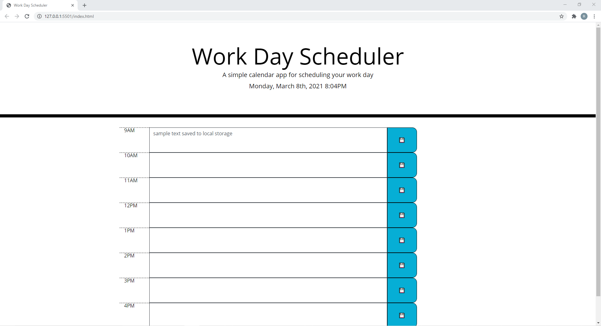

# Work Day Scheduler

Allows user to input text in time blocks for each hour in the workday. Clicking the save button next to the text will store the text in local storage. Loading the page again with items in the local storage will display in the boxes. 

https://biggronn.github.io/WorkScheduleRWH/

